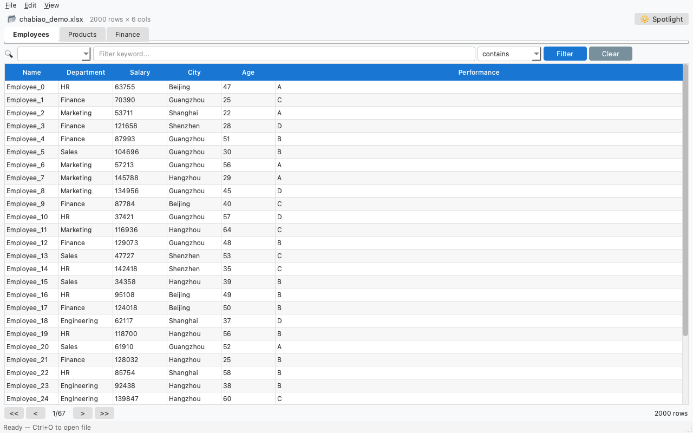
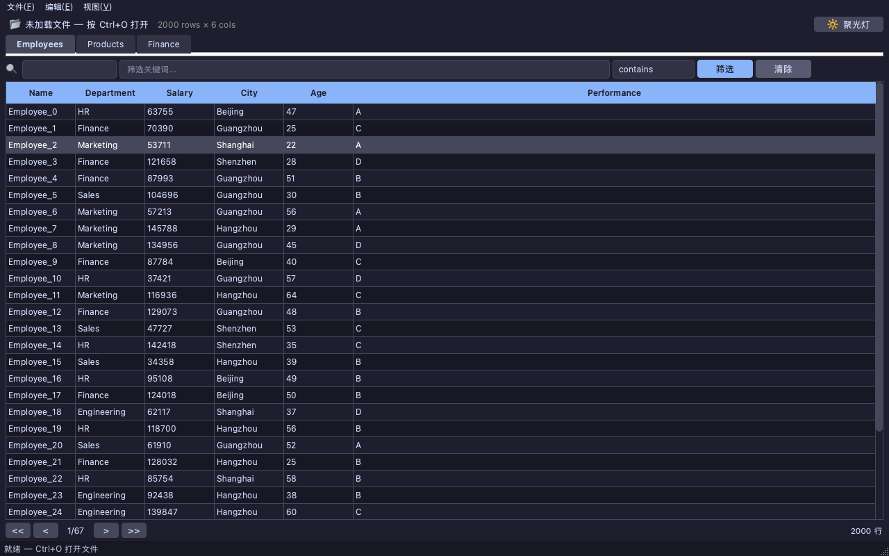
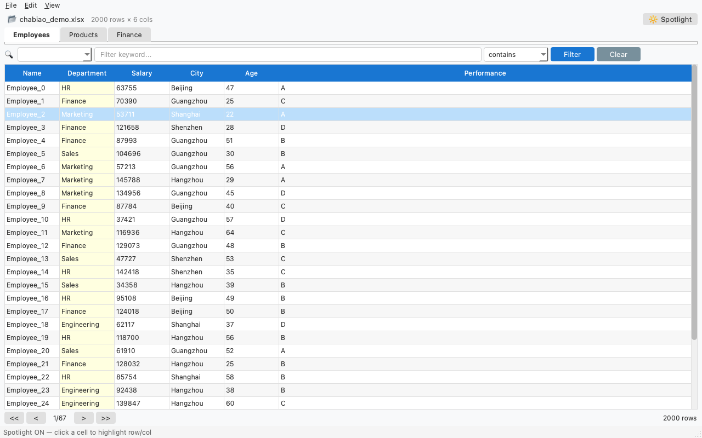
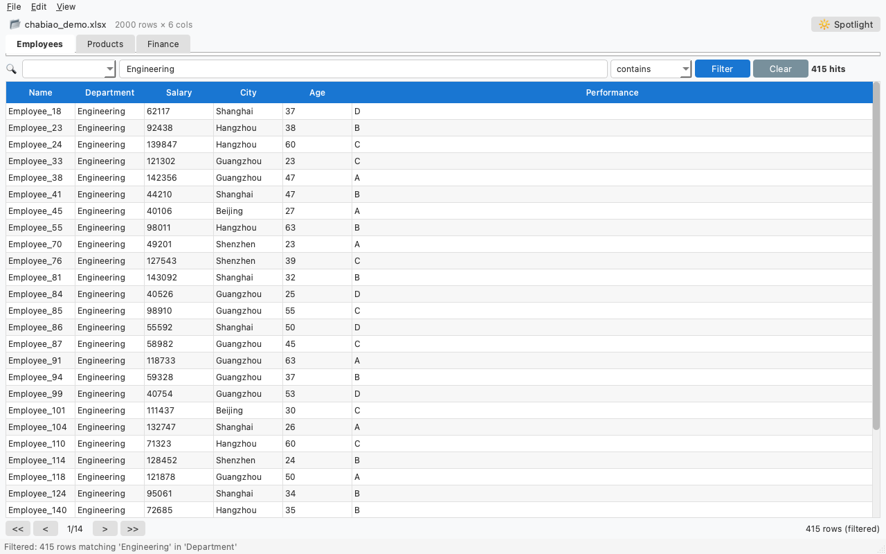
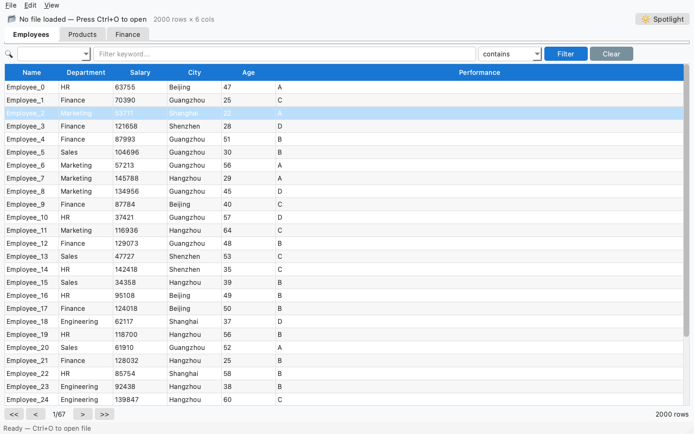

# ChaBiao 查表 - 闪电般的表格查阅筛选工具

⚡ 专为大型 Excel 文件（15MB+，2万行+）打造的极速表格查看、筛选和处理工具。Excel 筛选下拉菜单再也不卡了！




## 功能特性

- **极速筛选**：列筛选瞬间响应，不再等待 Excel 筛选下拉菜单加载
- **关键词搜索**：跨列全文搜索，支持正则表达式
- **聚光灯/焦点单元格**：高亮当前行和列，方便阅读（等同 Excel 聚光灯功能）

- **多工作表标签页**：标签页切换工作表（单工作表时自动隐藏）
- **列排序**：点击列标题头升序/降序排列
- **交叉引用**：在一个表中搜索，提取列到另一个表（查表整合）
- **数据图表**：可选 pyqtgraph 可视化图表（需安装 pyqtgraph）
- **多格式支持**：.xlsx, .xls, .csv, .tsv, .xlsm, .ods
- **三种界面**：CLI 命令行、PySide6 GUI 桌面界面、FastAPI Web 界面
- **10种语言**：🇨🇳 中文 · 🇺🇸 English · 🇯🇵 日本語 · 🇫🇷 Français · 🇷🇺 Русский · 🇩🇪 Deutsch · 🇪🇸 Español · 🇧🇷 Português · 🇮🇹 Italiano · 🇰🇷 한국어
- **暗色主题**：Catppuccin 风格暗色主题，GUI 和 Web 均可切换
- **分页显示**：500行/页，大文件滚动流畅
- **数据聚合**：数据透视表、分组统计、分类汇总
- **文件对比**：合并比较两个表格文件
- **格式转换**：在 xlsx、csv、json、tsv 之间转换，Web 导出支持分页
- **Agent 集成**：OpenAI function-calling 工具定义，支持 AI Agent 调用

## 系统要求

- Python >= 3.10
- pandas >= 2.0
- openpyxl >= 3.1
- tabulate >= 0.9

可选依赖：
- PySide6 >= 6.5（GUI 界面）
- pyqtgraph >= 0.13（图表功能，可选）
- FastAPI + uvicorn（Web 界面）

## 安装

```bash
# 基础安装（仅 CLI）
pip install chabiao

# 安装 GUI 支持（包含 pyqtgraph 图表）
pip install chabiao[gui]

# 安装 Web 支持
pip install chabiao[web]

# 安装全部功能
pip install chabiao[all]

# 开发模式
pip install chabiao[dev]
```

## 快速开始

### 命令行 (CLI)

```bash
# 打开并查看表格文件
chabiao open data.xlsx

# 按列筛选 - 各种条件
chabiao filter data.xlsx --column City --contains Beijing
chabiao filter data.xlsx --column Price --gt 100 --lt 500
chabiao filter data.xlsx --column Sales --top-n 10

# 跨列搜索关键词
chabiao search data.xlsx --keyword error --columns Message,Level

# 数据聚合（类似 Excel 数据透视表）
chabiao aggregate data.xlsx --group-by City --agg Sales:sum --agg Price:mean

# 比较/合并两个文件
chabiao compare data1.xlsx data2.xlsx --on ID --how left

# 导出为不同格式
chabiao export data.xlsx -o output.csv --format csv

# 聚光灯查看特定行
chabiao spotlight data.xlsx --row 100 --column Price
```

### Python API

```python
from chabiao import open_file, filter_data, search_data, spotlight_view

# 打开表格文件
result = open_file(input_path="data.xlsx")
print(result.success)    # True
print(result.data)       # 文件信息和元数据

# 筛选数据
result = filter_data(input_path="data.xlsx", column="城市", contains="北京")
print(result.data["total_rows"])  # 匹配行数

# 跨列搜索
result = search_data(input_path="data.xlsx", keyword="错误", columns=["消息"])
print(result.data["total_matches"])

# 聚光灯查看行
result = spotlight_view(input_path="data.xlsx", row=100, column="价格")
print(result.data["row_data"])       # 完整行数据
print(result.data["column_stats"])   # 列统计信息
```

### GUI 桌面界面

```bash
# 启动 GUI
chabiao-gui

# 直接打开文件
chabiao-gui data.xlsx

# 指定暗色主题和中文
chabiao-gui data.xlsx --theme dark --lang zh

# 自定义每页行数
chabiao-gui data.xlsx --page-size 200
```




功能特性：
- 命令行直接打开文件：`chabiao-gui data.xlsx`
- 命令行选项：`--lang zh --theme dark --page-size 200`
- 10种语言切换：菜单 → 视图 → 语言
- 亮色/暗色主题切换：菜单 → 视图 → 主题
- 即时列筛选（contains/equals/regex/search）
- 聚光灯模式（F6）高亮行和列
- 点击列标题排序
- 多工作表标签页切换
- 图表可视化（F7，需安装 pyqtgraph）
- 大文件分页显示（500行/页）
- 复制选择到剪贴板（Ctrl+C）
- 导出为 CSV/JSON/Excel

### Web 界面

```bash
chabiao-web
```

在浏览器中打开 http://localhost:8900，支持语言切换（`?lang=zh`）和暗色主题（`?theme=dark`）。Web 导出支持分页参数 `?start=0&limit=1000` 处理大数据集。

## 使用方法

### CLI 统一参数

| 参数 | 说明 |
|------|------|
| `-V, --version` | 显示版本 |
| `-v, --verbose` | 详细输出 |
| `-o, --output` | 输出文件路径 |
| `--json` | 以 JSON 格式输出 |
| `-q, --quiet` | 静默模式 |

### CLI 命令

| 命令 | 说明 |
|------|------|
| `open` | 打开并查看表格 |
| `filter` | 按列条件筛选 |
| `search` | 跨列搜索关键词 |
| `aggregate` | 分组聚合数据 |
| `compare` | 比较/合并两个文件 |
| `export` | 导出为不同格式 |
| `spotlight` | 聚光灯查看行/单元格 |

### 筛选选项

| 选项 | 说明 |
|------|------|
| `--contains` | 文本包含筛选 |
| `--regex` | 正则表达式筛选 |
| `--equals` | 精确匹配筛选 |
| `--not-equals` | 不等于筛选 |
| `--gt` / `--lt` | 大于 / 小于 |
| `--ge` / `--le` | 大于等于 / 小于等于 |
| `--top-n` | 前 N 个值 |
| `--bottom-n` | 后 N 个值 |
| `--above-avg` | 高于平均值 |
| `--below-avg` | 低于平均值 |

## Agent 集成（OpenAI Function Calling）

```python
from chabiao.tools import TOOLS, dispatch

# 在 OpenAI API 调用中使用 TOOLS
response = client.chat.completions.create(
    model="gpt-4",
    messages=[...],
    tools=TOOLS,
)

# 分发工具调用
for tool_call in response.choices[0].message.tool_calls:
    result = dispatch(tool_call.function.name, tool_call.function.arguments)
    print(result)
```

可用工具：
- `chabiao_open_file` - 打开并查看表格
- `chabiao_filter_data` - 各种条件筛选
- `chabiao_search_data` - 跨列搜索关键词
- `chabiao_aggregate_data` - 分组聚合数据
- `chabiao_compare_data` - 比较/合并两个文件
- `chabiao_export_data` - 导出为不同格式
- `chabiao_spotlight` - 聚光灯查看行/单元格

## 开发

```bash
# 开发模式安装
pip install -e ".[dev]"

# 运行测试
pytest

# 代码检查和格式化
ruff format . && ruff check .

# 类型检查
mypy chabiao

# 构建
python -m build
```

## 许可证

GPL-3.0-or-later